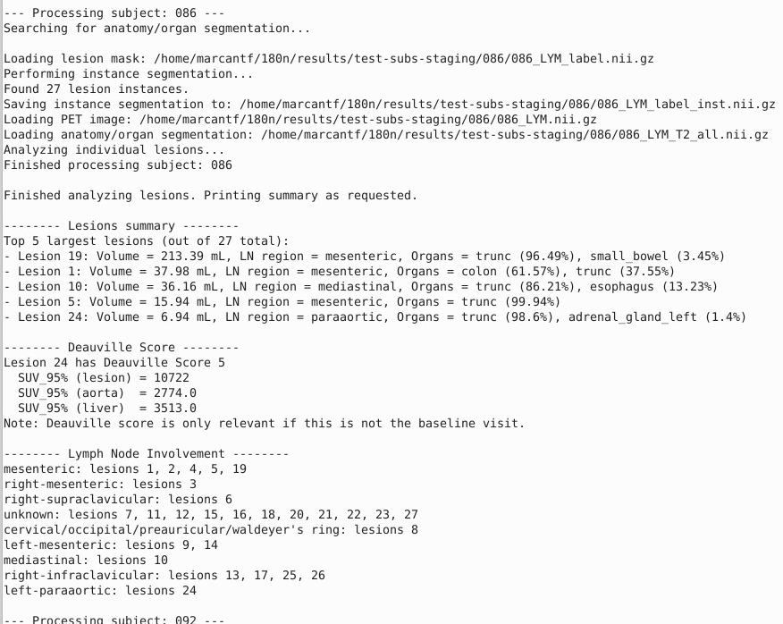

# Lymphoma Staging:


#### 1) The three following files need to be present for each subject and organized in the following way:

<pre> /dataset-for-staging 
├── sub001 
|      ├── 001_LYM.nii.gz (PET AC image)
|      ├── 001_LYM_label.nii.gz (Lesion segmentation)
|      └── 001_LYM_T2.nii.gz (T2w MR image)
├── sub002
|      ├── 002_LYM.nii.gz
|      ├── 002_LYM_label.nii.gz
|      └── 002_LYM_T2.nii.gz
├── sub003
...
 </pre>
 - **Note**: The `LYM_label.nii.gz` needs to be a segmentation of the lesions with the value 1 where lesions are identified and 0 elsewhere, probably obtained from the previous .


---

#### 2) Both the organ and body segmentations from the T2w image need to be performed for all subjects with the following command:

```
conda activate totalseg

python3 organ_seg/run_total_segmentator.py -i /home/marcantf/180n/results/test-subs-staging/ --one  --subdirs --filter T2.nii.gz [--cpu] 

```

- where:
	- `-i/-o`  are both the input and output directories respectively.
		- if `-o` is not set, it defaults to `-i`.
	- `--one` is a flag to put if you want to have all segmented labels into one single label map (we recommend using this flag).
		- For some reasons, the `Totalsegmentator` team creates one NIFTI file per label, which is quite impractical in my opinion.
	- `--subdirs` is used to specify explicitly to the script to expect subdirectories inside the input directory provided by `-i`.
	- ``--fitler`` is a flag to specify a substring to tell the script which file to use as input for segmentation (e.g., the `T2.nii.gz` for the T2w MR image)
	- `--cpu` to run the segmentation tasks on the CPU instead of GPU.
		- GPU is highly recommended for this step. Significant increase in computational time should be expected also.

- **Notes**:
    - The `TotalSegmentator` needs to be run inside a virtual environment where it was installed.
    - We have decided to keep both the `180n` and `totalseg` python virtual environments separated since the latter is quite more beefy and only used for the organ/body segmentation tasks. 
        - The installation should be quite straightforward following [these instructions](https://github.com/wasserth/TotalSegmentator/tree/master?tab=readme-ov-file#installation) (literally one line if you have a python virtual environment). 

- Running this script will create two individual label maps/segmentations:
	1) `XXX_LYM_T2_oseg.nii.gz` where the full body MR image is segmented into 50 labels.
	2) `XXX_LYM_T2_body.nii.gz` where the T2w MR image is segmented into (1) trunc and (2) extremities.
	- **Note**: See the [TotalSegmentator GitHub repository](https://github.com/wasserth/TotalSegmentator/tree/master)  for more details.
	- Both label maps will be combined in the next step.
	- This script should last ~3 min per subject.

---

#### 3) Combine both the organ and body segmentation into one label map running the following command line:
	- **Note**: Reactivate the `180n` python virtual environment now, we don't need the `totalseg` one.

```
python3 organ_seg/merge_total_and_body_mr.py -i XX [--onedir]
```

- where:
	- ``-i`` is the input directory containing either subdirectories or files.
	- `--onedir` is the flag to specify whether the input directory contains subdirectories or not.
		- Can be a useful flag if you want to process only one subdirectory for instance.

- This script will create a new label map called `XXX_LYM_T2_all.nii.gz` where the two previous label maps have been combined **and** where the extremities have been separated into left- and right- arms/legs and head.
- At this stage your original input directory should look like this:
<pre> /dataset-for-staging 
├── sub001 
|      ├── 001_LYM.nii.gz (PET AC image)
|      ├── 001_LYM_label.nii.gz (Lesion segmentation)
|      ├── 001_LYM_T2.nii.gz (T2w MR image)
|      ├── 001_LYM_T2_oseg.nii.gz (Organ segmentation)
|      ├── 001_LYM_body.nii.gz (Trunc/Extremities segmentation)
|      └── 001_LYM_T2_all.nii.gz (Organ+Body segmentation)
├── sub002
|      ├── 002_LYM.nii.gz (PET AC image)
|      ├── 002_LYM_label.nii.gz (Lesion segmentation)
|      ├── 002_LYM_T2.nii.gz (T2w MR image)
|      ├── 002_LYM_T2_oseg.nii.gz (Organ segmentation)
|      ├── 002_LYM_body.nii.gz (Trunc/Extremities segmentation)
|      └── 002_LYM_T2_all.nii.gz (Organ+Body segmentation)
├── sub003
...
 </pre>


---

#### 4) Finally, we are now able to run the staging script that will allow us to stage the subjects with this command line:

```
python3 post-training/analyze_lesions.py -i XX [--lesion_pattern LYM_label.nii.gz --anat_pattern T2_all.nii.gz --onedir --topn TOPN --print_summary]
```

- where:
	- `-i` is the input and output directory.
	- `--lesion_pattern/anat_pattern` are, respectively, the substring to identify the lesion and combined organ+body label maps/segmentations.
	- `--onedir` is the flag to specify whether the input directory contains subdirectories or not.
		- Can be a useful flag if you want to process only one subdirectory for instance.
	- ``--topn`` is a flag to print the N largest lesions detected for each subject with their metric values (e.g., volume, SUV_95percentile).
	- `--print_summary` is a flag to put if you want to print out an overall summary of the lesion analysis performed for each subject.
	- **Note**: If you followed the naming convention as described above, you should be able to only provide the input directory and the `--print_summary` and it should run properly. 

- Running this script will create a .csv file for each subject where all information extracted from the lesion analysis is saved. 
- We recommend the user to use the ``--print_summary`` flag so hat it can see "in real time" the sumamry and staging inferred from the analysis.
	- This summary is human-readable and more practical than the .csv (to be used for further analyses if desired).
	- The summary output should look like this:  
